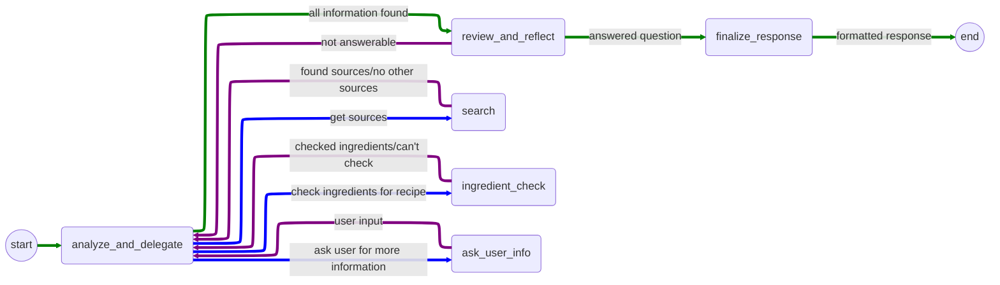

# Chef AI API
⚠️ **In Development** ⚠️

Chef AI is a conversational AI tool that helps users discover new recipes, learn cooking techniques, and answer recipe-related questions.

## Features

### Broad-Search Features (`chef/api/search/`):
Broad search features allow users to search for recipes based on a variety of criteria, such as ingredients, cuisine, diet, and meal type.
- **Recipe Search** (`/chat`): Find recipes conversationally by asking for recipes with certain ingredients or by asking for recipes by name.
- **Recipe Search By Ingredients** (`/`): Find recipes by providing a list of ingredients you have on hand. <mark>This is passed into the request body</mark>

### Recipe Specific Features (`chef/api/recipe/{source_id}/`):
- **Recipe Q&A**(`/qa`): Ask questions about a recipe, such as "What is the cooking time for this recipe?" or "What are the ingredients for this recipe?"
- **Ingredient Check**(`/check`): Check if you have all the ingredients for a recipe.
- **Recipe Customization**: Customize a recipe by asking for ingredient substitutions or modifications via the chat interface. 

## Nodes
### Analyze & Delegate: `analyze_and_delegate`
This node is responsible for analyzing the user query and delegating the query to the appropriate node to gather more information or to answer the query.

### Search: `search`
This node is responsible for finding relevant information to use to answer the user query. The search is done on an implementation of Graph-Rag where the nodes are recipes and Q&A information. The edges are created from keyword tags for entities extracted from the recipe documents, such as ingredients.

Searching will return a list of sources that are relevant to the user query. If no sources are found, the node will return a message indicating that no new sources were found and added to the state.

#### Recipe Scope
Some queries only require information regarding a specific recipe. In this case, the search node will only search for information regarding the specific recipe or look for information that directly refrence the recipe's **`id`** in their metadata.'

### Ingredient Check: `ingredient_check`
This node is responsible for checking if the user has all the ingredients for a recipe. If the user has all the ingredients, the node will return a message indicating that the user has all the ingredients. If the user does not have all the ingredients, the node will return a message indicating which ingredients the user is missing.

### Ask User Info: `ask_user_info`
This is a human-in-the-loop node that is responsible for asking the user for more information if the information provided is not enough to answer the user query. The node will ask the user for more information and pass the information back to the delegate node.

### Review & Reflect: `review_and_reflect`
This node is responsible for reviewing the information provided and answering the user query. If more information is needed, the node will request more information from the delegate node. If the user query is answered, the node will summarize the information and score the sources by relevance to the user query.
