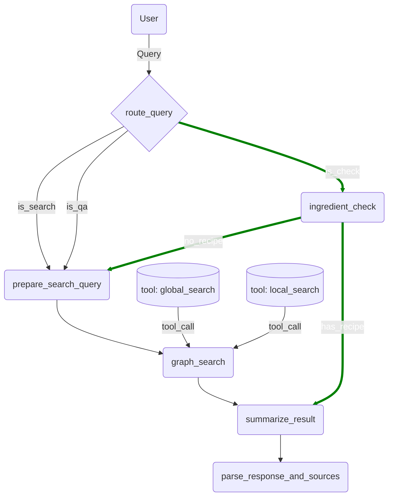

# Chef AI API

Chef AI is a conversational AI tool that helps users discover new recipes, learn cooking techniques, and answer recipe-related questions.

## Features

### Broad-Search Features (`chef/api/search/`):
Broad search features allow users to search for recipes based on a variety of criteria, such as ingredients, cuisine, diet, and meal type.
- **Recipe Search** (`/chat`): Find recipes conversationally by asking for recipes with certain ingredients or by asking for recipes by name.
- **Recipe Search By Ingredients** (`/`): Find recipes by providing a list of ingredients you have on hand. <mark>This is passed into the request body</mark>

### Recipe Specific Features (`chef/api/recipe/{source_id}/`):
- **Recipe Q&A**(`/qa`): Ask questions about a recipe, such as "What is the cooking time for this recipe?" or "What are the ingredients for this recipe?"
- **Ingredient Check**(`/check`): Check if you have all the ingredients for a recipe.
- **Recipe Customization**: Customize a recipe by asking for ingredient substitutions or modifications via the chat interface. 

## Nodes
### `route_query`
This node is responsible for routing the user query to the appropriate tool based on the user's intent and call the respective tool to process the query.

| Route Name |       Route Node       | Description |
|------------|------------------------|---------------------------------------------------------------|
| `/search`  | `prepare_search_query` | Search for a recipe with chat context and/or ingredient tags. |
| `/qa`      | `prepare_search_query` | Ask questions about a specific recipe |
| `/check`   | `ingredient_check`     | Check if you have all the ingredients for a specific recipe. |

<mark>Note: If the user passes an api route name, identifying user intent will be skipped.</mark>

### `prepare_search_query`
This node is responsible for preparing the query with the necessary parameters, dictated by the scope of the search. There are two types of search: global and local. The global search is responsible for searching across all sources, while the local search is responsible for searching within a source such as a specific recipe.

The node runs search on an graph-rag implemented on a vector database(like ChromaDB). Local & Global search interact in the same way, but the local search filters out irrelevant results that are not significant to the source context(like a user selected recipe).

### `graph_search`
This node is responsible for calling the global and local search tools to search for relevent information based on the query.

### `summarize_result`
This node is responsible for summarizing the search results in a way that answers the user query.

### `parse_response_and_sources`
This node is responsible for parsing the response based on the scope of the query. The result includes the llm response, the sources used to generate the response and relevent metadata.